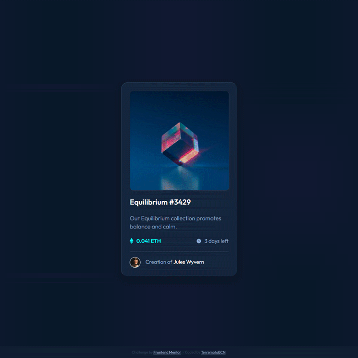

# Frontend Mentor - NFT preview card component solution

[Frontend Mentor](https://www.frontendmentor.io/challenges/) challenges help you
improve your coding skills by building realistic projects.

This challenges help you improve your coding skills by building realistic
projects. To do this challenge, you need a basic understanding of HTML and CSS.

This is a solution to the
[NFT preview card component challenge on Frontend Mentor](https://www.frontendmentor.io/challenges/nft-preview-card-component-SbdUL_w0U).

## Table of contents

-   [Overview](#overview)
    -   [The challenge](#the-challenge)
    -   [Screenshot](#screenshot)
    -   [Links](#links)
-   [My process](#my-process)
    -   [Built with](#built-with)
    -   [What I learned](#what-i-learned)
    -   [Continued development](#continued-development)
    -   [Useful resources](#useful-resources)
-   [Author](#author)
-   [Acknowledgments](#acknowledgments)

<!-- **Note: Delete this note and update the table of contents based on what sections
you keep.** -->

## Overview

### The challenge

The challenge is to build out this preview card component and get it looking as
close to the design as possible.

Users should be able to:

-   See hover states for interactive elements
    -   In the thumbnail picture.
    -   In the NFT name.
    -   In the author name

### Screenshot

### Links

-   Solution URL:
    [Github Repository](https://github.com/terremotoBCN/nft-preview-card-component-main)
-   Live Site URL:
    [Github Pages](https://terremotobcn.github.io/nft-preview-card-component-main/)

## My process

### Built with

-   Semantic **HTML5** markup
-   **CSS3** with custom properties
-   [**Sass**](https://sass-lang.com/documentation) - stylesheet language that’s
    compiled to CSS
    -   ITCSS + BEM Methologies.

### Continued development

The next step is to convert this NFT card into a web component with the help of
[LIT](https://lit.dev), a simple library for building fast, lightweight web
components.

On the other hand I will continue looking for new challenges in Frontend Mentor.

### Useful resources

-   [Sass](https://sass-lang.com/documentation) - A stylesheet language that’s
    compiled to CSS

-   [minireset.css](https://jgthms.com/minireset.css/) - A tiny modern CSS reset

-   [ITCSS](https://speakerdeck.com/dafed/managing-css-projects-with-itcss?slide=5) -
    Managing CSS Projects with ITCSS

-   [BEM](http://getbem.com/) - Block Element Modifier is a methodology that
    helps you to create reusable components and code sharing in front-end
    development.

-   [LIT element](https://lit.dev/) - Simple & Fast Web Components.

## Author

-   Frontend Mentor -
    [@terremotoBCN](https://www.frontendmentor.io/profile/terremotoBCN)
-   Twitter - [@terremotoBCN](https://www.twitter.com/terremotoBCN)
-   WordPress - [@terremotobcn](https://terremotobcn.wordpress.com/)
-   Tumblr - [@terremotobcn](https://terremotobcn.tumblr.com/)

## Acknowledgments

Many thanks to [Frontend Mentor](https://www.frontendmentor.io) and its
fantastic community that allows us to grow and improve as Frontend developers.
